
<picture><source media="(prefers-color-scheme: dark) and (max-width: 600px)" srcset="assets/banner-narrow-dark.svg"><source media="(max-width: 600px)" srcset="assets/banner-narrow-light.svg"><source media="(prefers-color-scheme: dark)" srcset="assets/banner-dark.svg">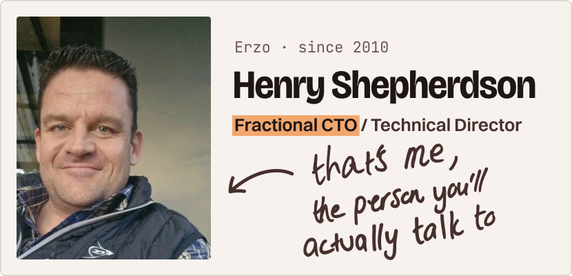</picture>

I'm the Technical Director at [Erzo](https://erzo.co.za), which started in Johannesburg in 2010, and I work as a Fractional CTO for businesses that need senior technical leadership without a full-time hire. I'm based between Cape Town, Johannesburg and Durban, working with clients in South Africa, the UK and the US.

Most of my work lives in private client repos, so this page sums it up without naming names.

## What I build

<picture><source media="(prefers-color-scheme: dark)" srcset="assets/build/websites-dark.svg">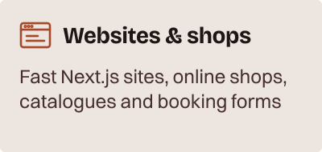</picture>
<picture><source media="(prefers-color-scheme: dark)" srcset="assets/build/saas-dark.svg">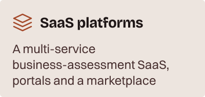</picture>
<picture><source media="(prefers-color-scheme: dark)" srcset="assets/build/security-dark.svg">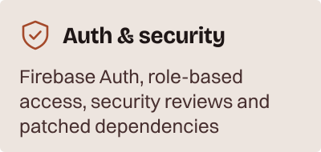</picture>
<picture><source media="(prefers-color-scheme: dark)" srcset="assets/build/forms-dark.svg">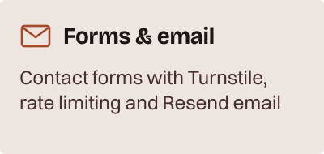</picture>
<picture><source media="(prefers-color-scheme: dark)" srcset="assets/build/ereaders-dark.svg">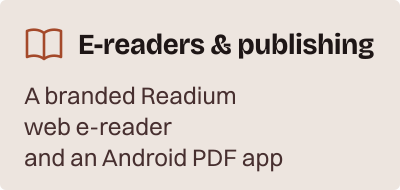</picture>
<picture><source media="(prefers-color-scheme: dark)" srcset="assets/build/windows-dark.svg">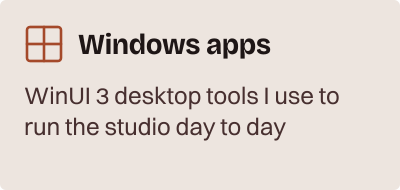</picture>
<picture><source media="(prefers-color-scheme: dark)" srcset="assets/build/ai-dark.svg">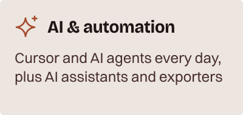</picture>
<picture><source media="(prefers-color-scheme: dark)" srcset="assets/build/accessibility-dark.svg">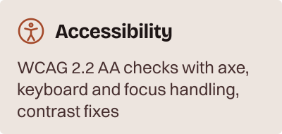</picture>

<strong>The longer list</strong>

**Client websites, shops and catalogues**
- Fast Next.js sites for guesthouses, salons, engineering firms, florists, writers and training providers
- Online shops with cart, checkout, PayPal, coupons and shipping estimates, plus a separate shop manager and a FastAPI product API
- A course catalogue with bundles, monthly payment terms, currency-aware pricing, wishlists and filters
- Room availability and booking-request forms for accommodation sites
- Photo galleries with lightbox and focal-point cropping, AVIF/WebP images, Open Graph, sitemaps and PWA support
- Accessibility built in: WCAG 2.2 AA checks with axe, keyboard and focus handling, and contrast fixes

**SaaS platforms**
- A multi-service business-assessment SaaS (Next.js, NestJS, FastAPI)
- A subscriber portal with seat management and Stripe subscriptions
- A marketplace that matches homeowners with service professionals, with Paystack billing and an admin console
- B2B ordering with generated PDF documents, an onboarding portal with admin invites, a PWA checklist app with photo capture, and an events app with group chat and live unread counts

**Auth and security**
- Firebase Auth sign-up, email verification, invites and role-based access
- Security reviews and hardening, with dependencies kept patched
- Next.js security upgrades rolled out across 17 repos
- CSP and security headers set at build time

**Contact forms, email and bot protection**
- Serverless contact endpoints on Cloudflare with Turnstile, validation, a honeypot, rate limiting and Resend email
- Enquiry and booking forms with Resend or Nodemailer on about a dozen sites
- Consent-first Google Analytics with an equal-choice consent card

**E-readers and publishing**
- A branded web e-reader built on my fork of Readium's [Thorium Web](https://github.com/FPMedia/thorium-web), with Firebase sign-in, running on Cloudflare
- Publications served by my fork of [Readium CLI](https://github.com/FPMedia/readium-cli) on Railway, with Cloudflare R2 storage
- A native Android PDF reader (Kotlin, Jetpack Compose) with CI-built APKs
- Article archives, podcast pages and SEO metadata for an author's site

**Windows apps**
- A WinUI 3 desktop dashboard (MSIX) for running the studio: clients, projects, Toggl time tracking with timers, and WSL and Windows Terminal launchers

**AI and automation**
- I build day to day with Cursor and AI coding agents
- An AI Telegram assistant (OpenAI, Whisper) that handles text, voice and documents
- A WordPress-to-Next.js content exporter
- Open tools: [transcriber](https://github.com/FPMedia/transcriber) (Whisper) and [video-optimiser](https://github.com/FPMedia/video-optimiser)

## By the numbers

<!-- stats:start (generated by scripts/build-cards.mjs, don't edit by hand) -->

<em>As of 3 October 2026, counting public and private repos.</em>

<picture><source media="(prefers-color-scheme: dark)" srcset="assets/stats/repos-dark.svg">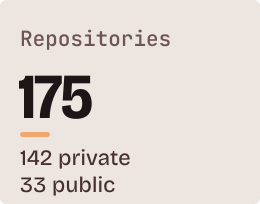</picture>
<picture><source media="(prefers-color-scheme: dark)" srcset="assets/stats/active-dark.svg">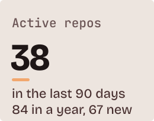</picture>
<picture><source media="(prefers-color-scheme: dark)" srcset="assets/stats/contributions-dark.svg">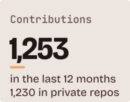</picture>
<picture><source media="(prefers-color-scheme: dark)" srcset="assets/stats/commits-dark.svg">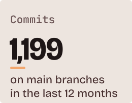</picture>
<picture><source media="(prefers-color-scheme: dark)" srcset="assets/stats/days-dark.svg">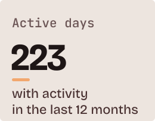</picture>
<picture><source media="(prefers-color-scheme: dark)" srcset="assets/stats/nextjs-dark.svg">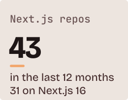</picture>

<picture><source media="(prefers-color-scheme: dark) and (max-width: 600px)" srcset="assets/stats/languages-narrow-dark.svg"><source media="(max-width: 600px)" srcset="assets/stats/languages-narrow-light.svg"><source media="(prefers-color-scheme: dark)" srcset="assets/stats/languages-dark.svg">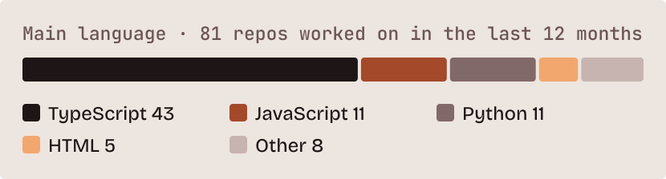</picture>

<!-- stats:end -->

## Stack

- **Mostly:** Next.js, React and TypeScript, with Tailwind CSS
- **Also:** Python (FastAPI), Node (NestJS, Fastify, Hono, Express), other JavaScript, and WinUI 3 / C# for Windows apps
- **Data and auth:** PostgreSQL (Prisma, Drizzle), Redis, Firebase Auth
- **Hosting:** Railway and Cloudflare, with Docker and GitHub Actions
- **Email:** Resend
- **How I work:** Cursor and AI agents, with changes going through pull requests

<picture><source media="(prefers-color-scheme: dark)" srcset="assets/signature-henry-dark.svg">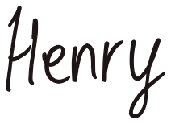</picture>

<a href="https://erzo.co.za/ideas"><picture><source media="(prefers-color-scheme: dark)" srcset="assets/button-ideas-dark.svg"></picture></a>
<a href="https://www.linkedin.com/in/henry-shepherdson/"><picture><source media="(prefers-color-scheme: dark)" srcset="assets/button-linkedin-dark.svg">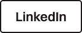</picture></a>

Or use the [Erzo contact page](https://erzo.co.za/contact).
